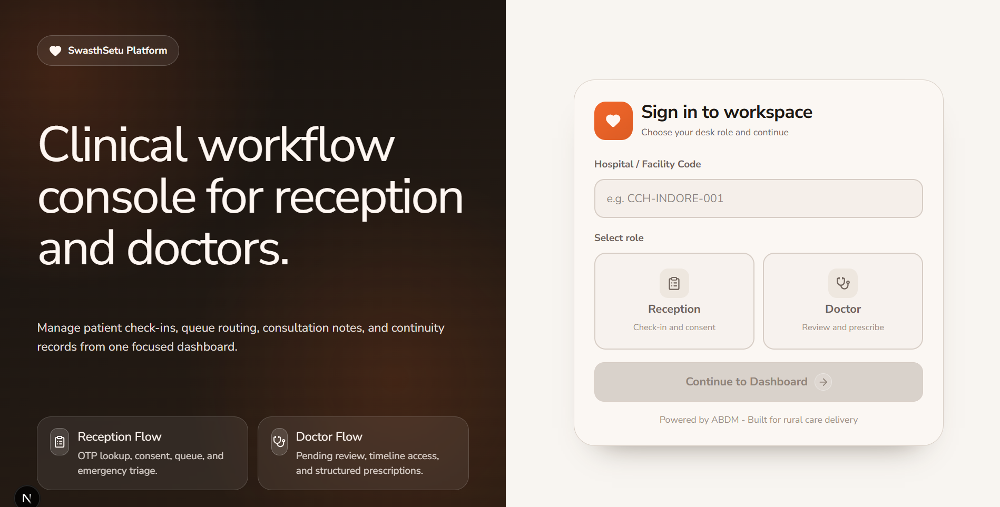
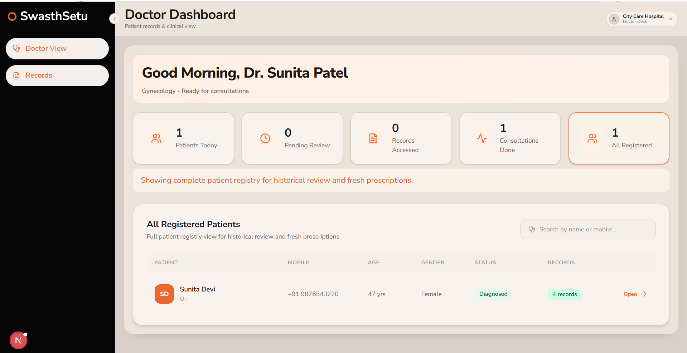
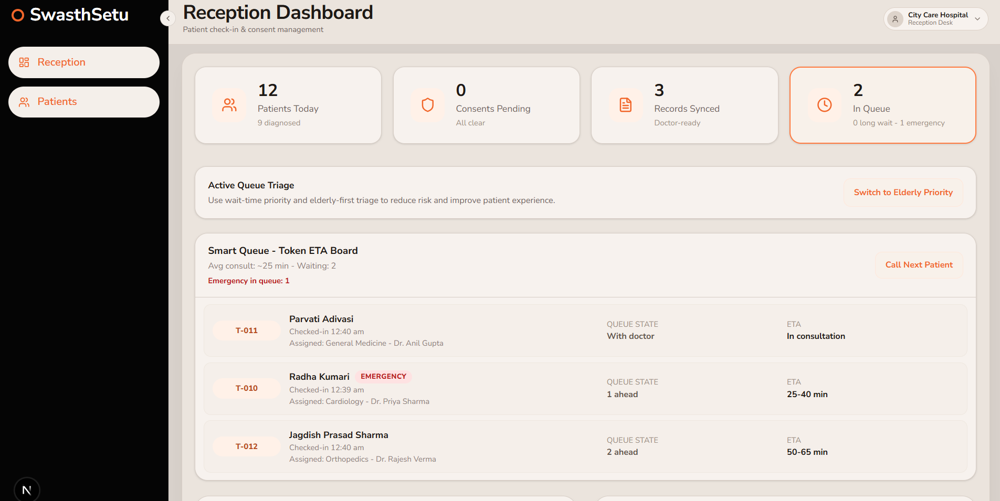
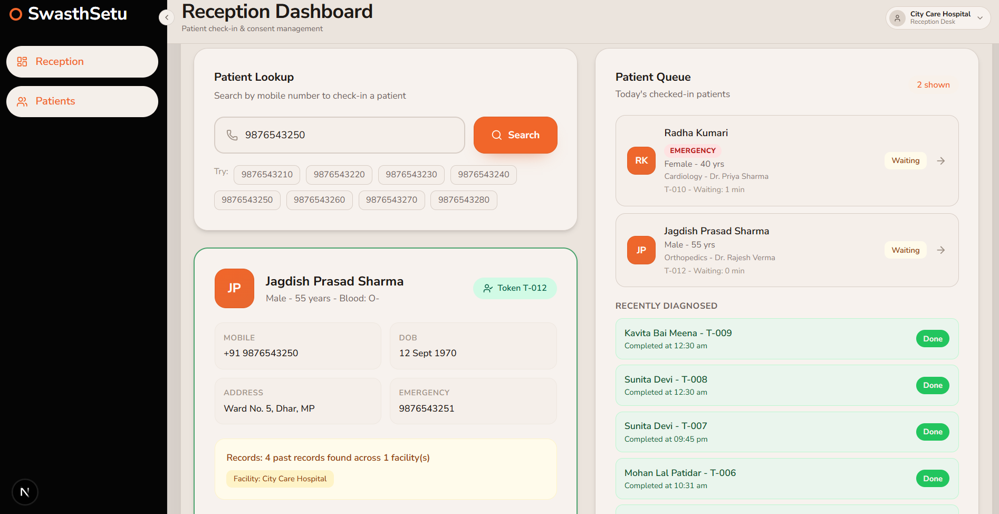
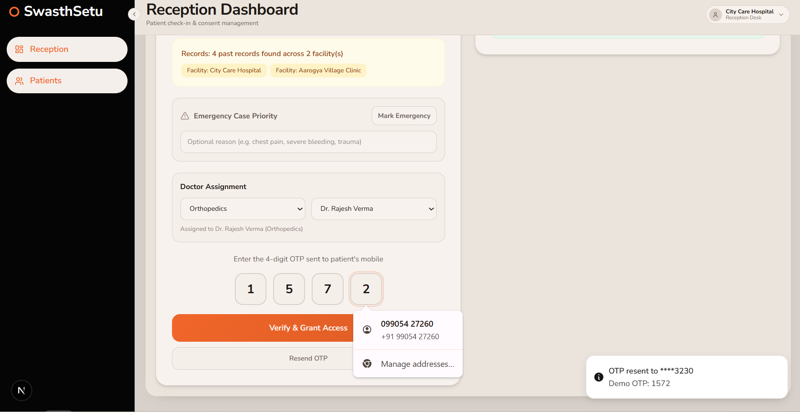
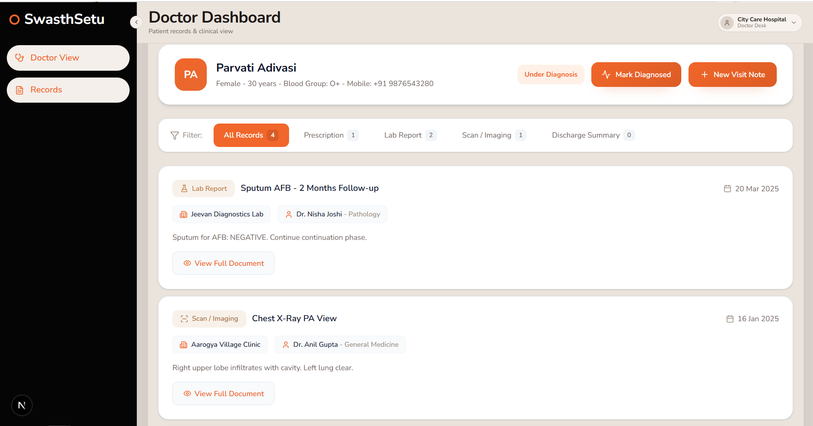

# SwasthSetu AI - Care Continuity Platform

## 1. Project Summary

SwasthSetu AI is a role-based clinical workflow application for **reception desks** and **doctors**.  
It demonstrates how patient discovery, consent capture, queue triage, consultation, and visit-note continuity can be handled in a single system.

The project is implemented as a Next.js App Router application with:

- role-aware login and route protection
- API routes for patient search, consent, and records
- MongoDB-backed persistence with automatic fallback to in-memory demo data
- queue and triage orchestration on the frontend (localStorage-backed)

This README is designed for judges and evaluators to understand and run the project quickly on a local machine.

---

## 2. Problem Statement and Scope

Healthcare continuity often breaks when:

- patient records are distributed across facilities
- consultation starts before prior context is visible
- triage and doctor handover are not synchronized

This project addresses that with:

1. reception-led patient lookup and consent
2. doctor assignment and queue intake
3. emergency-first and FIFO triage rules
4. doctor timeline review and new visit-note creation
5. immediate timeline update after record submission

---

## 3. Technology Stack

- Framework: Next.js `16.2.1` (App Router, Turbopack)
- Runtime: React `19.2.4`
- Language: TypeScript
- Styling: global CSS with inline style objects in pages/components
- Icons: `lucide-react`
- Motion: `framer-motion`
- Toasts: `sonner`
- Database: MongoDB (optional in local setup, supported in API layer)

---

## 4. Architecture Overview

## 4.1 High-level Layers

1. UI layer (`src/app`, `src/components`)
- Login, Reception dashboard, Doctor dashboard, Patient timeline.

2. API layer (`src/app/api`)
- Search patient, request/verify consent, fetch/upload records, doctor auth.

3. Data access layer (`src/lib/server-data.ts`)
- Unified store abstraction: Mongo when configured, otherwise in-memory mock.

4. Shared domain data (`src/data/mock-data.ts`)
- Patients, doctors, facilities, records, helper methods.

5. Queue state (`src/lib/patient-queue.ts`)
- Client-side queue persisted in browser `localStorage`.

6. Route security (`src/proxy.ts`)
- Role and doctor-session cookie checks for `/reception/*` and `/doctor/*`.

## 4.2 Request/Data Flow

1. User logs in from `/`.
2. Reception searches patient by mobile (`POST /api/patients/search`).
3. Reception requests OTP consent (`POST /api/consent/request`).
4. Reception verifies OTP (`POST /api/consent/verify`) and enqueues patient.
5. Doctor sees queue on `/doctor` and opens patient timeline.
6. Timeline loads records (`GET /api/records/timeline`).
7. Doctor submits new visit note (`POST /api/records/upload`), timeline updates immediately.

---

## 5. Role Workflows

## 5.1 Reception Workflow

1. Search patient by 10-digit mobile number.
2. Review patient demographics and historical record summary.
3. Mark emergency (optional) with reason.
4. Assign department and doctor.
5. Request OTP, verify OTP.
6. Patient gets queue token and appears in queue/ETA board.

## 5.2 Doctor Workflow

1. View active queue and dashboard stats.
2. Emergency and queue-order constraints gate who can be opened next.
3. Open patient timeline.
4. Filter records by type.
5. Add a new visit note (diagnosis, medications, notes, follow-up).
6. Mark consultation diagnosed.

---

## 6. Local Setup for Judges

## 6.1 Prerequisites

- Node.js `20.x` or newer
- npm `10.x` or newer
- Optional: local or cloud MongoDB instance

## 6.2 Installation

From repository root:

```bash
cd swasthsetu-app
npm install
```

## 6.3 Environment Configuration

Create `.env.local` inside `swasthsetu-app`.

Mac/Linux:

```bash
cp .env.example .env.local
```

PowerShell:

```powershell
Copy-Item .env.example .env.local
```

Required variables:

| Variable | Required | Description |
|---|---|---|
| `MONGODB_URI` | Optional (recommended) | Mongo connection string. If absent, APIs fall back to in-memory mock store. |
| `MONGODB_DB_NAME` | Optional (recommended) | Mongo database name. |
| `DOCTOR_SESSION_SECRET` | Optional | Secret used for demo session-token signing. Defaults to internal fallback if not set. |

Example (local Mongo):

```env
MONGODB_URI=mongodb://127.0.0.1:27017/
MONGODB_DB_NAME=swasthsetu
```

## 6.4 Run Development Server

```bash
npm run dev
```

Open:

- `http://localhost:3000`

## 6.5 Production Build Validation

```bash
npm run build
npm run start
```

---

## 7. Demo Credentials and Test Data

## 7.1 Doctor Login Credentials

Doctor login validates:

- `doctorId`
- selected `department` must match doctor specialty
- `passcode`

Demo passcodes:

| Doctor ID | Doctor Name | Specialty | Passcode |
|---|---|---|---|
| `doc-001` | Dr. Anil Gupta | General Medicine | `4271` |
| `doc-002` | Dr. Priya Sharma | Cardiology | `5924` |
| `doc-003` | Dr. Rajesh Verma | Orthopedics | `7843` |
| `doc-004` | Dr. Sunita Patel | Gynecology | `9157` |
| `doc-005` | Dr. Vikram Singh | Pediatrics | `2689` |
| `doc-006` | Dr. Nisha Joshi | Pathology | `6403` |

## 7.2 Demo Patient Mobile Numbers

- `9876543210`
- `9876543220`
- `9876543230`
- `9876543240`
- `9876543250`
- `9876543260`
- `9876543270`
- `9876543280`

## 7.3 OTP Behavior

- OTP is generated and returned as `otp_hint` in demo mode.
- Consent verification grants 24-hour access window.
- This is intentionally demo-friendly and not production OTP security behavior.

---

## 8. API Reference

| Endpoint | Method | Purpose | Source File |
|---|---|---|---|
| `/api/auth/doctor-login` | `POST` | Doctor authentication and session cookie setup | `src/app/api/auth/doctor-login/route.ts` |
| `/api/auth/doctor-logout` | `POST` | Clears doctor session cookies | `src/app/api/auth/doctor-logout/route.ts` |
| `/api/patients/search` | `POST` | Lookup patient by mobile number | `src/app/api/patients/search/route.ts` |
| `/api/consent/request` | `POST` | Create consent request and OTP | `src/app/api/consent/request/route.ts` |
| `/api/consent/verify` | `POST` | Verify OTP and grant consent | `src/app/api/consent/verify/route.ts` |
| `/api/records/timeline` | `GET` | Fetch enriched patient timeline records | `src/app/api/records/timeline/route.ts` |
| `/api/records/upload` | `POST` | Create and sync new medical record | `src/app/api/records/upload/route.ts` |

---

## 9. Screenshots

All screenshots are included inside `swasthsetu-app/docs/screenshots`.

### 9.1 Login Screen


### 9.2 Doctor Dashboard Overview


### 9.3 Reception Smart Queue and ETA Board


### 9.4 Reception Patient Lookup and Queue Pane


### 9.5 Consent OTP Verification and Doctor Assignment


### 9.6 Doctor Patient Timeline View


---

## 10. Complete File Inventory

This section lists every file in the repository workspace excluding `.git`, `.next`, and `node_modules`.

| File Path | Purpose |
|---|---|
| `README.md` | Project-level technical guide for setup, architecture, and evaluation. |
| `swasthsetu-app/.env.example` | Environment-variable template for Mongo configuration. |
| `swasthsetu-app/.env.local` | Local environment values used by this machine (not intended for commit). |
| `swasthsetu-app/.gitignore` | Ignore rules for build output, env files, logs, and dependencies. |
| `swasthsetu-app/AGENTS.md` | AI coding assistant instruction file; not part of runtime logic. |
| `swasthsetu-app/CLAUDE.md` | AI tool directive file; not part of runtime logic. |
| `swasthsetu-app/dev-clean.err.log` | Development stderr log artifact from local runs. |
| `swasthsetu-app/dev-clean.log` | Development stdout log artifact from local runs. |
| `swasthsetu-app/eslint.config.mjs` | ESLint configuration using Next.js core-web-vitals and TypeScript presets. |
| `swasthsetu-app/next-env.d.ts` | Auto-generated Next.js TypeScript environment reference. |
| `swasthsetu-app/next.config.ts` | Next.js config (Turbopack root and allowed dev origin). |
| `swasthsetu-app/package-lock.json` | Dependency lockfile for deterministic npm installs. |
| `swasthsetu-app/package.json` | Scripts, dependencies, and metadata for the app package. |
| `swasthsetu-app/postcss.config.mjs` | PostCSS plugin registration (`@tailwindcss/postcss`). |
| `swasthsetu-app/README.md` | App-level pointer that directs readers to the canonical root README. |
| `swasthsetu-app/Screenshot 2026-04-03 003831.png` | Original screenshot capture (login screen). |
| `swasthsetu-app/Screenshot 2026-04-03 003919.png` | Original screenshot capture (doctor dashboard). |
| `swasthsetu-app/Screenshot 2026-04-03 004201.png` | Original screenshot capture (reception smart queue). |
| `swasthsetu-app/Screenshot 2026-04-03 004214.png` | Original screenshot capture (lookup and queue panel). |
| `swasthsetu-app/Screenshot 2026-04-03 004311.png` | Original screenshot capture (OTP verification section). |
| `swasthsetu-app/Screenshot 2026-04-03 004343.png` | Original screenshot capture (doctor patient timeline). |
| `swasthsetu-app/tsconfig.json` | TypeScript compiler settings and path alias (`@/* -> src/*`). |
| `swasthsetu-app/docs/screenshots/01-login-screen.png` | Curated screenshot used in README gallery. |
| `swasthsetu-app/docs/screenshots/02-doctor-dashboard-overview.png` | Curated screenshot used in README gallery. |
| `swasthsetu-app/docs/screenshots/03-reception-smart-queue.png` | Curated screenshot used in README gallery. |
| `swasthsetu-app/docs/screenshots/04-reception-patient-lookup.png` | Curated screenshot used in README gallery. |
| `swasthsetu-app/docs/screenshots/05-consent-otp-verification.png` | Curated screenshot used in README gallery. |
| `swasthsetu-app/docs/screenshots/06-patient-timeline.png` | Curated screenshot used in README gallery. |
| `swasthsetu-app/public/file.svg` | Default template static SVG asset (currently unused by app pages). |
| `swasthsetu-app/public/globe.svg` | Default template static SVG asset (currently unused by app pages). |
| `swasthsetu-app/public/next.svg` | Default Next.js static SVG asset (currently unused by app pages). |
| `swasthsetu-app/public/vercel.svg` | Default Vercel static SVG asset (currently unused by app pages). |
| `swasthsetu-app/public/window.svg` | Default template static SVG asset (currently unused by app pages). |
| `swasthsetu-app/src/proxy.ts` | Route guard for role-based path protection and doctor session verification. |
| `swasthsetu-app/src/app/favicon.ico` | Browser tab icon asset. |
| `swasthsetu-app/src/app/globals.css` | Global styles, theme variables, shell layout, and utility animations. |
| `swasthsetu-app/src/app/layout.tsx` | Root layout, metadata, font setup, and global `Toaster`. |
| `swasthsetu-app/src/app/page.tsx` | Login page for role selection and doctor authentication UI. |
| `swasthsetu-app/src/app/api/auth/doctor-login/route.ts` | Validates doctor credentials and sets role/session cookies. |
| `swasthsetu-app/src/app/api/auth/doctor-logout/route.ts` | Clears doctor session cookies. |
| `swasthsetu-app/src/app/api/consent/request/route.ts` | Creates consent request and returns demo OTP hint. |
| `swasthsetu-app/src/app/api/consent/verify/route.ts` | Verifies OTP and marks consent granted. |
| `swasthsetu-app/src/app/api/patients/search/route.ts` | Searches patient by mobile number via store abstraction. |
| `swasthsetu-app/src/app/api/records/timeline/route.ts` | Returns enriched timeline (record + doctor + facility context). |
| `swasthsetu-app/src/app/api/records/upload/route.ts` | Validates and persists new medical records. |
| `swasthsetu-app/src/app/doctor/layout.tsx` | Doctor shell layout with sidebar/topnav and role cookie persistence. |
| `swasthsetu-app/src/app/doctor/page.tsx` | Doctor dashboard, queue gates, patient listing, and action routing. |
| `swasthsetu-app/src/app/doctor/patient/[id]/page.tsx` | Patient timeline page, record filtering, document drawer, new visit modal. |
| `swasthsetu-app/src/app/reception/layout.tsx` | Reception shell layout with sidebar/topnav and role cookie persistence. |
| `swasthsetu-app/src/app/reception/page.tsx` | Reception dashboard: search, consent OTP, assignment, queue triage, ETA board. |
| `swasthsetu-app/src/components/layout/Sidebar.tsx` | Collapsible role-specific navigation sidebar. |
| `swasthsetu-app/src/components/layout/TopNav.tsx` | Header with page title/subtitle and desk context. |
| `swasthsetu-app/src/data/demo-doctor-passcodes.ts` | Static demo doctor passcodes used by auth flow. |
| `swasthsetu-app/src/data/mock-data.ts` | Domain model types and in-memory facilities/doctors/patients/records datasets. |
| `swasthsetu-app/src/lib/auth.ts` | Role and doctor cookie constants/utilities. |
| `swasthsetu-app/src/lib/doctor-credentials.ts` | Server-only doctor passcode verification function. |
| `swasthsetu-app/src/lib/doctor-session.ts` | Doctor session token generation/verification logic. |
| `swasthsetu-app/src/lib/mongodb.ts` | Mongo connection management and configuration checks. |
| `swasthsetu-app/src/lib/patient-queue.ts` | Local queue store, triage, diagnosis transition, subscription helpers. |
| `swasthsetu-app/src/lib/server-data.ts` | Unified data-access layer with Mongo + in-memory fallback strategy. |

---

## 11. Troubleshooting

## 11.1 `tailwindcss` Resolution Error

If you see an error resolving `tailwindcss` from repository root, make sure commands are run from:

```bash
cd swasthsetu-app
```

Then run:

```bash
npm install
npm run dev
```

## 11.2 Queue Not Shared Across Browsers

Queue state is intentionally client-side (`localStorage`) for this prototype.  
Use the same browser profile/tab context during evaluation for consistent queue behavior.

## 11.3 Mongo Not Available

If MongoDB is not configured or unavailable, API calls automatically fall back to in-memory demo data.  
This keeps the prototype executable without external infrastructure.

---

## 12. Implementation Notes for Evaluation

- The project is prototype-oriented and optimized for demonstrable workflow correctness.
- Authentication is demo-grade and uses static doctor passcodes.
- Consent OTP is demo-visible (`otp_hint`) to simplify local judging.
- Core value is workflow continuity across reception and doctor views with structured patient context.
